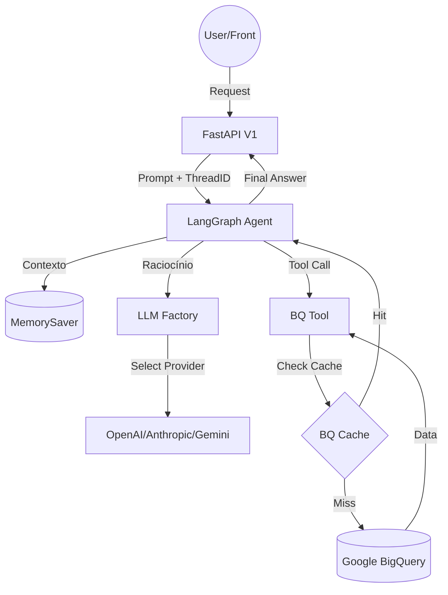

# Arquitetura do Sistema

O projeto utiliza orquestração via LangGraph, suporte a múltiplos LLMs e camadas de otimização de performance e memória.

## Visão Geral

Agente de IA especializado em análise de mídia (Performance/BI). Traduz linguagem natural para SQL (BQ), operando com memória persistente e cache de consultas.

## Componentes

### 1. Orquestração e Memória (LangGraph)
- **MemorySaver**: Persistência de curto prazo via `thread_id`. O agente mantém contexto entre perguntas na mesma sessão.
- **LLM Factory**: Abstração que permite troca dinâmica de provedores (OpenAI, Anthropic, Google) via env var.
- **Self-Healing SQL**: Loop de correção automática em caso de erro de sintaxe no BigQuery.

### 2. Performance e Custos
- **BQ Query Cache**: Cache em memória para resultados de consultas frequentes, reduzindo latência e custo de processamento no BQ.
- **Tenacity**: Retry com backoff exponencial para resiliência de rede.
- **Cost Guard**: Monitoramento em tempo real de tokens e custos, com trava de segurança parametrizável.

### 3. Segurança e Infra
- **X-API-KEY**: Middleware de autenticação nas rotas da API.
- **Pydantic Settings**: Validação forte de configurações e segredos.
- **Docker Multi-stage**: Imagem otimizada rodando com usuário não-root (princípio de menor privilégio).

## Stack
- Python 3.12+ (uv manager)
- FastAPI / Streamlit
- LangGraph / LangChain
- BigQuery (GCP)
- Docker / K8s
